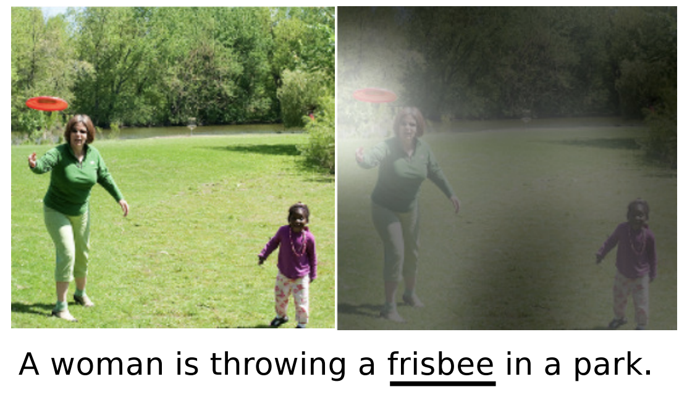

# 自然语言处理 {#nlp}

*陈美昆、蒋慧华、高光远*

```{r setup, include=FALSE}
knitr::opts_chunk$set(eval = F)
```

```{r history,echo=F, eval=T, out.width="70%",fig.align = 'center',fig.cap="NLP历史（2000年以后）"}
knitr::opts_chunk$set(fig.pos = "!H", out.extra = "")
knitr::include_graphics("./plots/7/history.png")
```

```{r frisbee,echo=F, eval=T, out.width="70%",fig.align = 'center',fig.cap="扔飞盘"}
knitr::opts_chunk$set(fig.pos = "!H", out.extra = "")

```

在保险业，大量的书面证据，如保单合同或索赔通知，以及客户与企业对话助理互动的记录，为数据科学家和精算师提供了越来越多的可供分析的文本信息。

NLP在保险行业中的应用：

- 根据文字描述的索赔类型和严重程度对索赔进行分类

- 对电子邮件、保单、合同的分类

- 从文本数据中识别欺诈案例等

## 预处理

1. 输入原始文本和格式

2. 将文本转化为小写

3. 分词（ tokenization ）

4. 删除停用词（ stopwords ）

5. 词性标注（ part-of-speech (POS) tagging ）

6. 词干提取或词形还原（Stemming or Lemmatization）

## Bag of words

## Bag of part-of-speech

## Word embeddings

### Neural probabilistic language model

### word2vec

### Global vectors for word representation

## Pre-trained word embeddings

## 神经网络

### LSTM

### GRU

## Case study

```{r files, echo=F, eval=T, out.width="70%",fig.align = 'center',fig.cap="文档结构"}
knitr::opts_chunk$set(fig.pos = "!H", out.extra = "")
knitr::include_graphics("./plots/7/files.png")
```

```{r procedure,echo=F, eval=T, out.width="70%",fig.align = 'center',fig.cap="nlp4class_exercise步骤"}
knitr::opts_chunk$set(fig.pos = "!H", out.extra = "")
knitr::include_graphics("./plots/7/procedure.png")
```

- 任务描述：根据电影评论文本判断该评论是“好评”还是“差评”

- 数据来源： Internet Movie Database (IMDb)

- 数据量：案例中共有5000条含分类信息（pos/neg）的原始数据，从计算资源是运行时间考虑，我们从原始数据中随机抽取了1%，即500条数据进行测试，测试数据在toymdb文件夹下，文件结构和原始数据一致（需要注意的是， toymdb文件夹包含train和test两个文件，但并不是实际处理时的“训练集”和“测试集”，实际训练时读取所有数据并重新划分“训练集”和“测试集” ，所以实际上train和test中的文件没有区别，只是沿袭了原始数据的存储结构）。

- 数据结构：评论位置代表类别，一个txt存储一个评论数据。 

### 函数说明


1. 格式清理
引入re包，定义preprocessor函数，该函数的目的是对文本中的非字母数字符号进行剔除，该函数的输出是与原文本对应的字符串，该字符串是由一系列被空格分隔开的单词组成的，并且所有字母都是小写。

```
import re
def preprocessor(text):
    text = re.sub('<[^>]*>', '', text)
    emoticons = re.findall('(?::|;|=)(?:-)?(?:\)|\(|D|P)', text)
    text = (re.sub('[\W]+', ' ', text.lower()) +
            ' '.join(emoticons).replace('-', ''))
    return text

```

2. 分词
可以直接调用nltk.tokenize包中的word_tokenize对评论（英文）文本进行分词。

```
from nltk.tokenize import word_tokenize
tokens = word_tokenize(text)

```
3. 删除停止词
调用nltk包中的stopwords，将上一步得到的单词列表中出现在stopwords中的所有单词删除。

```
import nltk
from nltk.corpus import stopwords
stopwords = list(set(stopwords.words('english')))

filtered_tokens = [word for word in tokens if word not in stopwords]

text_filtered = ' '.join(filtered_tokens)

```
4. 词性标注
pos_tag是nltk包中已经训练好的词性标注模型，它的输入为分词后单词列表，列表中的每个元素是一个单词（字符串类型）；它的输出是与输入列表等长的列表，输出列表中的每个元素是一个格式为(word, tag)的元组，其中word为输入列表中的单词，tag为与该单词对应的词性。

```
from nltk import pos_tag
nltk.download('averaged_perceptron_tagger')

def pos_tags(text_processed):
    return "-".join( tag for (word, tag) in nltk.pos_tag(text_processed))

pos_tag = pos_tags(filtered_tokens)

```

5. TfidfVectorizer
TfidfVectorizer是sklearn中已经训练好的文本向量化模型，它的作用将输入的文本转化为向量，向量的维度是与输入文本对应的词典中单词的个数（即所有不同的单词出现的个数），每个维度对应的值为输入文本中该单词所对应的tfidf值。案例中用TfidfVectorizer实现bag of words和bag of POS两种方法的向量化，以下以bag of POS为例。注意，TfidfVectorizer.fit_transform()函数的输入是一个列表，列表中的每一个元素对应一个处理好的文本（字符串类型），如第3步中得到的'text_filtered'或第四步中得到的'pos_tag'。
         
```
from sklearn.feature_extraction.text import TfidfVectorizer
import pandas as pd

tfidf = TfidfVectorizer(strip_accents=None,
                        lowercase=False,
                        preprocessor=None)

tfidf_wm = tfidf.fit_transform([pos_tag])

``` 

6. word embeddings
spacy中有训练好的word embeddings方法，如'en_core_web_sm'，'en_core_web_md'，不同模型输出的向量维度和长短不同。
         
```
import spacy
nlp = spacy.load('en_core_web_sm') 

import numpy as np
emb = nlp(text_filtered).vector

``` 

### 可能遇到的问题

- 词性标注

```
  import nltk
  from nltk import pos_tag, word_tokenize
  出现LookupError
```

```
  解决方法：把'nltk_data.zip'里的文件全部拷贝至'/Users/huihuajiang/nltk_data/'         
  用以下命令可以查看你的 nltk_data 文件夹路径：             import nltk             
  print(nltk.data.path)
```

- 词嵌入

```
  import spacy
nlp = spacy.load(‘en_core_web_sm’) 
错误1：OSError: [E050] Can't find model 'en_core_web_sm'.
错误2：numpy.core.multiarray failed to import
```

```
  错误1解决方法1（可能不行）：
  命令行运行命令”python -m spacy download en_core_web_sm”
  错误1解决方法2：把模型下载到本地进行安装
  具体操作请参考 https://www.freesion.com/article/73801416523/
  错误2解决方法：重启一下终端
```

### 结果比较

*以下仅为表例*

$$
\begin{array}{|l|c|cc|c|}
\hline &  {\text { in-sample }} & {\text { out-of-sample }} & {\text { out-of-sample }}&  {\text { run times }}\\
& \text {both genders} & \text { female } & \text { male } & \text {both genders} \\
\hline \hline \text { LSTM3 }\left(T=10,\left(\tau_{0}, \tau_{1}, \tau_{2}, \tau_{3}\right)=(5,20,15,10)\right) & 4.7643 & 0.3402 & 1.1346 & 404 \mathrm{s}\\
\text { GRU3 }\left(T=10,\left(\tau_{0}, \tau_{1}, \tau_{2}, \tau_{3}\right)=(5,20,15,10)\right) & 4.6311 & 0.4646 & 1.2571 &  379 \mathrm{s} \\
\hline\hline \text { LSTM3 averaged over 100 different seeds} & - & 0.2451 & 1.2093 & 100 \cdot 404\mathrm{s}\\
\text { GRU3 averaged over 100 different seeds } & - & 0.2341& 1.2746 &  100 \cdot 379 \mathrm{s} \\
\hline \hline \text { LC model with SVD } & 6.2841 & 0.6045 &1.8152 &  - \\
\hline
\end{array}
$$


## 结论

我们用bag of words, bag of POS, word embeddings三种NLP模型对评论文本进行了向量化，并用ADA, RF, XGB三种机器学习方法对文档进行了分类，为此，我们引入了NLP管道来预处理文本数据 。最后，还采用RNN模型对文档进行了分类。

实验结果表明， 

- bag of words总体上变现更好， bag of POS的表现不佳。

- 与bag of words相比， word embedding模型的效率更高。

- Deep LSTM模型表现要比Single LSTM和更好。

- 与NLP模型相比，RNN模型性能更好，达到相同标准的时间更短。

- 如果用RNN的输入数据来拟合Ml模型，精度远不及RNN模型，可见RNN模型在该任务上能利用更少的信息实现更准确的分类。

